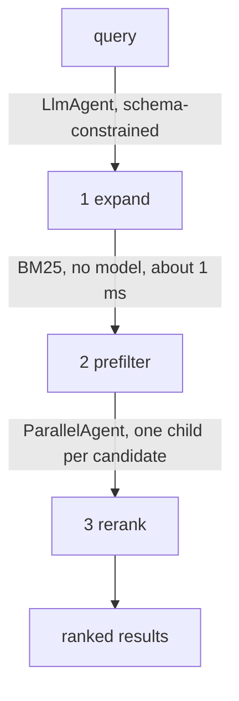

# TabFind: on-device tab search (TypeScript)

This project implements a Chrome extension that finds open tabs by what the
page is about rather than what its title says. The agent runs entirely in the
browser, on the language model Chrome ships with the device. There is no
server, no API key, and no network request.

Type *"that thing about the refund"* and get back the tab titled
**"Order #48213 — Return authorization"**. Those two strings share no words, so
Ctrl-F cannot make that match.

## Overview

TabFind exists to demonstrate two things that were not previously possible with
ADK for TypeScript:

1. **ADK runs in a browser.** The agent, the runner, the tools and the session
   service are the published `@google/adk` package, imported directly and
   bundled for the browser with no shims and no build workarounds.
2. **ADK can drive an on-device model.** Chrome's Prompt API returns a string;
   ADK's runner needs function calls. A custom `BaseLlm` builds one out of the
   other, using schema-constrained decoding.

The second is the reusable part. Everything else here is a demo of it.

## Agent Details

| Feature            | Description                              |
| ------------------ | ---------------------------------------- |
| _Interaction Type_ | Conversational, over a retrieval pipeline |
| _Complexity_       | Advanced                                 |
| _Agent Type_       | Multi-agent, fan-out                     |
| _Components_       | Custom `BaseLlm`, Tools, `ParallelAgent` |
| _Runtime_          | Browser: Chrome extension and web page   |
| _Model_            | Chrome's built-in on-device model        |

### Agent Architecture

Three fixed stages. The model never decides what happens next.



**Expand** turns the words into search terms — *"that thing about the refund"*
becomes `refund, return, rma, authorization, order`. Without it, BM25 never
surfaces the right tab.

**Prefilter** is deterministic. No model runs, it takes about a millisecond,
and it cannot hallucinate.

**Rerank** never asks the model to rank forty things at once. Each survivor
gets its own agent and one bounded question: here is a page, score it 0-3 and
say why in twelve words. Small models answer that reliably. Ranking forty items
in one context is exactly what they do badly.

This is **not** a speed optimization. Against a single prompt containing every
title it makes roughly eight times as many model calls. What it buys is
per-candidate attention, and the ability to show the model real page text —
forty pages do not fit in a small context window, ten do. `npm run eval` prints
both arms and does not dress up the comparison.

### The adapter is the reusable part

ADK's runner needs a model that emits **function calls**. Chrome's `prompt()`
returns a string.

Chrome does have a `tools` option, but it executes the tools itself and hands
back only the final text, which takes ADK out of its own loop: no tool
callbacks, no events, nothing to trace.

So [`src/model/chrome-prompt-llm.ts`](src/model/chrome-prompt-llm.ts) builds
function calling out of constrained decoding. It compiles ADK's tool
declarations into a JSON Schema union — *final answer*, or *call tool X with
these arguments* — passes that as `responseConstraint`, and parses the reply
back into ADK function-call parts. The runner sees an ordinary tool-calling
model. The API underneath has no such thing.

That adapter is proposed upstream as
[google/adk-js#843](https://github.com/google/adk-js/pull/843), so a future
version of this sample can delete it too.

### Key Features

- **Semantic tab search.** Finds a tab whose title shares no words with the
  query.
- **Every result explains itself.** Each hit carries a line describing the
  page, which is the proof it was understood rather than string-matched.
- **Nothing leaves the device.** Open the Network panel and watch it stay
  empty, or turn off wifi and search again.
- **An honest fallback.** With no usable model the app runs a scripted stand-in
  and says so, in a badge that cannot be missed.
- **A real eval.** `npm run eval` scores recall@3 against a single-prompt
  baseline and reports both.

#### Tools

Three `FunctionTool`s, defined in [`src/core/agent.ts`](src/core/agent.ts):

- `searchTabs`: runs the retrieval pipeline over the open tabs.
- `activateTab`: switches to a tab by id.
- `closeTabs`: closes tabs by id, after the user confirms.

## Setup and Installation

### Prerequisites

- **Chrome 138 or newer** for the extension. Chrome 148+ for the harness,
  which runs as a plain web page.
- **Desktop only.** macOS 13+, Windows 10/11, Linux, or ChromeOS on Chromebook
  Plus.
- **22 GB free disk**, and either more than 4 GB of VRAM or 16 GB of RAM with
  4 or more cores.
- **Node.js 20 or higher** to build.

Check the machine in ten seconds:

```bash
npm run doctor
```

Or open DevTools on any page and run `await LanguageModel.availability()`.
`"available"` or `"downloadable"` means you are fine.

### Installation

```bash
npm install
```

> **One extra step, for now.** This sample imports `@google/adk` directly and
> bundles it for the browser, which works once
> [#614](https://github.com/google/adk-js/pull/614) and
> [#618](https://github.com/google/adk-js/pull/618) are in a published release.
> Until then, run:
>
> ```bash
> npm run patch:adk
> ```
>
> That patches the installed copy in `node_modules` to look the way the
> released package will: one bundled browser entry, and the `browser` export
> condition. It changes nothing in this repository, and `npm ci` undoes it.
> When the release lands, `scripts/patch-adk.mjs`,
> `scripts/adk-browser-shims/` and this note all delete.

## Running the Agent

### As a Chrome extension

```bash
npm run build
```

1. Go to `chrome://extensions`
2. Turn on **Developer mode**
3. **Load unpacked**, and select the `dist/` folder
4. Press **Ctrl+Shift+K**, or **Cmd+Shift+K** on macOS

Open 20 to 30 real tabs first. With three tabs open there is nothing
interesting to find.

The first search downloads the model. Chrome fetches it once for the whole
browser, and it is a couple of gigabytes. The download only starts after you
interact with the page, so run a search and let it work.

### As a web page, with nothing installed

```bash
npm run serve
```

Open <http://localhost:8899/harness.html>. This runs against 40 synthetic tabs
and touches none of your real ones. It needs Chrome 148+, because the Prompt
API reached web pages later than it reached extensions.

Queries that work against the synthetic set:

| Type this                   | You should get                      |
| --------------------------- | ----------------------------------- |
| that thing about the refund | Order #48213 — Return authorization |
| the flight thing            | Itinerary confirmation — LHR to SFO |
| what do I need to sign      | DocuSign — Awaiting your signature  |
| the doctor thing            | Lab results are ready to view       |

## Commands

```bash
npm run build       # build the extension into dist/
npm run serve       # build and serve the harness
npm run dev         # rebuild on change
npm test            # 38 tests
npm run eval        # recall@3 against a single-prompt baseline
npm run typecheck
npm run check       # typecheck, build, test
npm run doctor      # can this machine run the model?
```

## No model?

The app falls back to a scripted stand-in and shows a `SIMULATED MODEL` badge.
The pipeline, the agents and the tool calls all still run; only the inference
is scripted, and the interface says so.

Never present that output as on-device inference. The badge exists so you
cannot do it by accident.

## License

Apache 2.0. See [LICENSE](LICENSE).

Demonstration code, not a supported product.
